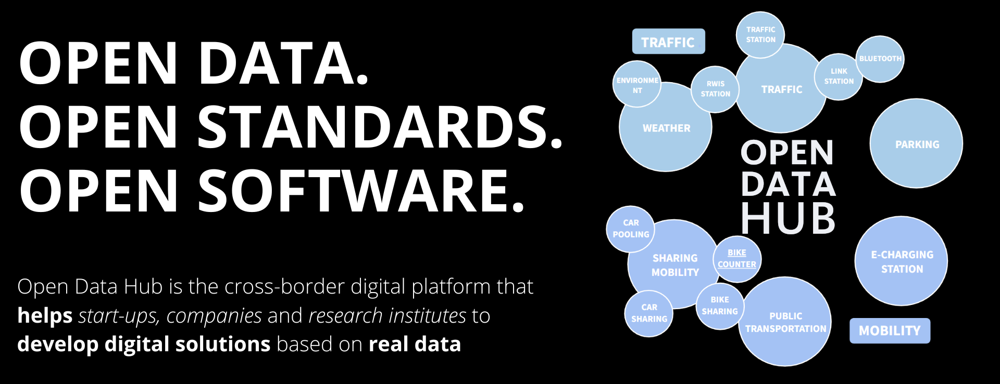

<!--
SPDX-FileCopyrightText: NOI Techpark <digital@noi.bz.it>

SPDX-License-Identifier: CC0-1.0
-->

# Hello!
### Welcome to NOI's organization on GitHub where we develop Free Open Source Software.
</img>

## Who are we?
Who is [NOI AG/S.p.a.](https://noi.bz.it/en)? 
What is the [Open Data Hub](https://opendatahub.com/)?

## Where can I find more information?
Our [wiki](https://github.com/noi-techpark/odh-docs/wiki) containing general information about our projects. 
Our [guidelines for developers](https://github.com/noi-techpark/odh-docs/wiki/Guidelines-for-developers-and-licenses) containing information for everyone wanting to contribute.

##
We are [REUSE](https://reuse.software) compliant, find more information about reuse in our projects [here](https://github.com/noi-techpark/odh-docs/wiki/REUSE).
